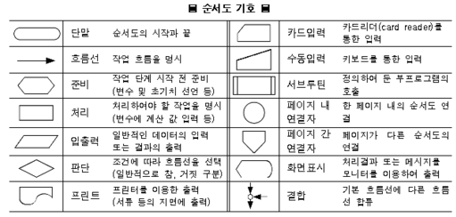

# 알고리즘이란?

문제를 해결하기 위한 것으로, 명확하게 정의되고 순서가 있는 유한 개의 규칙으로 이루어진 집합.

## 구조
- 순차적 구조 : 세 문장이 아래로 나란히 있다면 문장을 순서대로 실행시키는 구조.
- 선택 구조 : 괄호 안에 있는 식의 평가 결과에 따라 프로그램의 실행 흐름을 변경시키는 구조.

```C
    max = a;             // max에 a 값을 넣는다.
    if(b > max) max = b; // b 값이 max보다 크면 max에 b 값을 넣는다. 
    if(c > max) max = c; // c 값이 max보다 크면 max에 c 값을 넣는다.
    
    printf("최댓값 : %d", max);
```
## 식과 식의 평가
- 식 : 변수와 상수 혹은 변수나 상수를 연산자로 결합한 것.
- 평가 : 식의 값을 알아내는 것. 식을 평가하면 형과 값을 얻을 수 있음.

## 관계 연산자와 등가 연산자
- 공통적으로 참이면 int형 1을, 거짓이면 int형 0을 만든다.
- 관계 연산자 : 양쪽 피연산자의 대소 관계를 판단한다.
- 등가 연산자 : 값이 같은지의 관계를 판단한다.

## 매개변수 (parameter)
- 함수를 정의할 때 함수에 전달되는 값을 저장하기 위해 선언하는 변수.
- 함수를 정의할 때는 '매개변수', 함수를 호출할 때는 '실인수'라고 불린다.


## 조건 판단과 분기 ( 예시 )
- 흐름이 세 가지로 분기하는 것과 같은 형식이지만, 분기하는 모습은 다르다.
- 프로그램의 흐름은 실제로 네 가지로 분기한다.  
```c
    if(n==1)
        printf("it is 1.");
    else if(n==2)
        printf("it is 2.");
    else if(n==3)
        printf("it is 3.");
```
```c
    if(n==1)
        printf("it is 1.");
    else if(n==2)
        printf("it is 2.");
    else if(n==3)
        printf("it is 3.");
    else
        ; // 공백문
```

## 순서도의 기호
