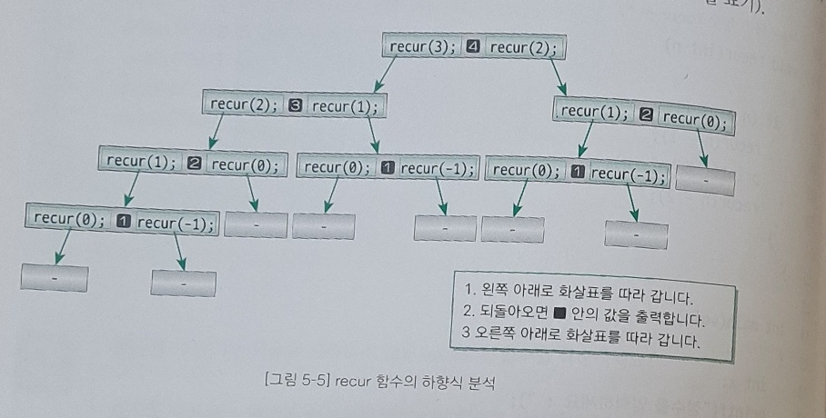
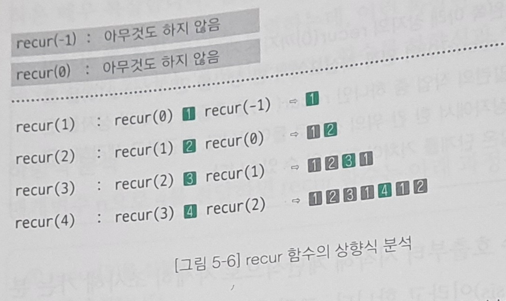

# 재귀 알고리즘 분석

<p>밑의 함수처럼 재귀 호출을 여러 회 실행하는 함수는 매우 복잡하다. 따라서 좀 더 전략적으로 분석해야하는데, 이 함수를 두 방법으로 나누어 분석할 수 있다.</p>

```c
    #include <stdio.h>

    void recur(int n){
        if(n>0){
            recur(n-1);
            printf("%d", &n);
            recur(n-2);
        }
    }
```

## 하향식 분석

<p>하향식 분석을 표로 나타낸 것은 다음과 같다. 이처럼 가장 위쪽에 위치한 함수의 호출부터 시작하여 계단식으로 내려가며 자세히 조사해 가는 분석 기법을 하향식 분석이라고 한다.</p>


## 상향식 분석
<p>아래쪽부터 쌓아올리며 분석하는 방법이다. 표로 나타낸 것은 다음과 같다.</p>


## 재귀 알고리즘의 비재귀적 표현

<p>함수의 꼬리에서 재귀 호출하는 함수 recure(n-2)라는 말은 '인자로 n-2를 전달하여 recur 함수를 호출한다'라는 의미이다. 따라서 이 호출은 아래처럼 바꿀 수 있다.</p>

> n의 값을 n - 2로 업데이트하고 함수의 시작 지점으로 돌아간다.

```c
    /*--- goto문을 이용한 재귀 알고리즘 ---*/

    void recur(int n){
    Top:
        if(n>0){
            recur(n-1);
            printf("%d", &n);
            n = n -2;
            goto Top;
        }
    }
```

<p>꼬리 재귀와 다르게 앞에서 호출한 재귀 함수는 이렇게 바꾸어 표현할 수 있다.</p>

> n의 값을 n - 1로 업데이트하고 함수의 시작 지점으로 돌아간다.  
> 현재 n의 값을 '잠시' 저장한다.  
> 저장했던 n을 다시 꺼내 그 값을 출력한다.