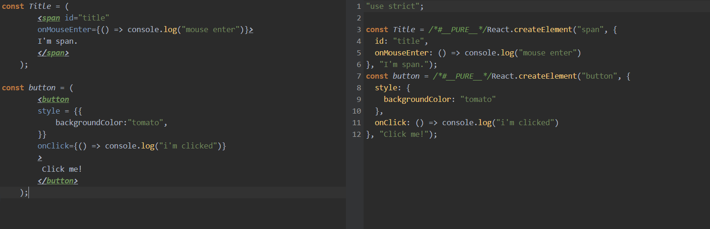

# JSX
<p>JSX는 자바스크립트를 확장한 문법이다. HTML과 문법이 비슷하여 JSX로 React 요소를 만드는 게 편리하다.</p>
- HTML과 같은 규칙을 사용한다.
- 코드를 보는 개발자 시점에서 이해하기가 훨씬 쉽다.
- JSX는 웹 브라우저가 인식하지 못하므로, 주석 처리되어있는 코드로 변환시키는 프로그램을 사용해야한다.

```jsx
    /*--- JSX로 span 태그 재작성 ---*/
    const Title = (
        <span id="title" 
        onMouseEnter={() => console.log("mouse enter")}>
        I'm span.
        </span>
    ); //JSX 코드
    /* createElement를 사용한 기존 코드
    const span = React.createElement(
        "span", 
        {
        id:"title",
        onMouseEnter: () => console.log("mouse enter"); // create mouse enter event
        } 
        "I'm span."
    );
    */
```
```jsx
    /*--- JSX로 button 재작성 ---*/
    const button = (
        <button 
        style = {{
            backgroundColor:"tomato",
        }}
        onClick={() => console.log("i'm clicked")} 
        >
         Click me!
        </button>
    )
    /* createElement를 사용한 기존 코드
    const button = React.createElement(
        "button", 
        {
        onClick: () => console.log("i'm clicked"), // create click event
        style: {
            backgroundColor:"tomato",
            },
        }, 
        "Click me!"
    );
    */
```

## Babel
- JSX로 작성한 코드들을 웹 브라우저가 읽을 수 있는 코드로 변환시켜주는 프로그램.<br>
https://babeljs.io/, 실행 결과


```html
    <!-- CDN 구성으로 다운받을 때 : -->
    <script src="https://unpkg.com/@babel/standalone/babel.min.js"></script>
    <script type="text/babel">/*--- 또는 type="text/jsx" ---*/</script> 
```