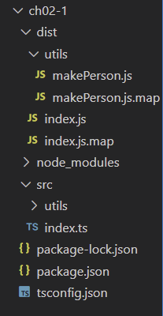

# 타입스크립트 프로젝트 만들기

- Node JS 프로젝트를 만들고, 개발 언어를 타입스크립트로 설정하는 방식으로 진행.
- Node JS 프로젝트는 디렉토리를 만들고, package.json 파일을 만드는 것으로 시작.
- package.json : 프로젝트 정보와 관련 패키지가 기록되는 패키지 관리 파일.

```json
> mkdir [폴더명]
> cd [폴더명]
> npm init --y
Wrote to C:\TIL\TypeScript\[폴더명]\package.json:

{
  "name": "[폴더명]",
  "version": "1.0.0",
  "description": "",
  "main": "index.js",
  "scripts": {
    "test": "echo \"Error: no test specified\" && exit 1"
  },
  "keywords": [],
  "author": "",
  "license": "ISC"
}
```

## 프로젝트 생성자 관점에서 패키지 설치

- 프로젝트를 전달받아 이용하는 다른 개발자의 컴퓨터에 패키지가 설치되어 있지 않을 수 있음.
- 이를 고려하여 package.json에 두 패키지(typescript, ts-node)를 등록하기.
```TS
> npm i -D typescript ts-node
```
- 타입스크립트는 기본적으로 자바스크립트 문법을 포함하고 있으나, 완전히 다른 언어이다.
- 타입이 명시적으로 설정되어야 코드가 문법에 맞게 작성되었는지 검증하여 동작시킴.
- chance, ramda와 같은 라이브러리들은 추가로 @types/chance, @types/ramda 등의 라이브러리를 제공해야함.
```TS
> npm i -D @types/node // 기본적인 타입을 사용하기 위한 패키지 설치
```

## 프로젝트 이용자 관점에서 패키지 설치
- 프로젝트를 구현할 때 여러 패키지를 설치하며 node_modules 디렉토리 크기가 매우 커짐.
- 따라서 다른 사람에게 프로젝트를 전달할 때에는 node_modules 디렉터리를 모두 지움.
```TS
> npm i // 전달받아 이용할 때 먼저 package.json 파일이 있는 디렉토리에서 명령 실행
```

## tsconfig.json 파일 만들기
- 타입스크립트 프로젝트는 타입스크립트 컴파일러의 설정 파일인 tsconfig.json 파일이 있어야 함.
```
> tsc --init
message TS6071 : Successfully created a tsconfig.json file.
```
- 기본 tsconfig.json 파일은 실제 개발을 진행하는 데 필요한 많은 옵션이 비활성화 되어있음.
```json
// 다음과 같이 tsconfig.json 파일 내용 수정하기
{
    "compilerOptions": {
        "module": "commonjs",
        "esModuleInterop": true,
        "target": "es5",
        "moduleResolution": "node",
        "outDir": "dist",
        "baseUrl": ".",
        "sourceMap": true,
        "downlevelIteration": true,
        "noImplicitAny": false,
        "paths": { "*": ["node_modules/*"]}
    },
    "include": ["src/**/*"] 
    // ./src와 ./src/utils 디렉터리에 모든 타입스크립트 소스 파일이 있음.
}
```
```TS
// 설정대로 디렉터리 생성하기
> mkdir -p src/utils
> touch src/index.ts src/utils/makePerson.ts
```
```TS
// src/utils/makePerson.ts
export function makePerson(name: String, age: Number){
    return {name: name, age: age}
}
export function testMakePerson(){
    console.log(
        makePerson('Jane', 22),
        makePerson('Jack',33)
    )
}
```
```TS
// src/index.ts
import { testMakePerson } from './utils/makePerson';
testMakePerson();
```

## package.json 개발 완료시 수정
- 타입스크립트를 개발할 때는 ts-node를 사용하지만 개발이 완료되면 소스코드를 JS코드로 변환해야함.

```json
{
    "name": "[폴더명]",
    "version": "1.0.0",
    "description": "",
    "main": "src/index.js",
    "scripts": {
        "dev" : "ts-node src",
        "build" : "tsc && node dist"
    }, 
    ...생략...
}
```
- Dev : src 디렉토리에 있는 index.ts 파일을 실행하는 용도.
- build : 개발이 완료된 후 프로그램을 배포하기 위해 파일을 만들 때 사용.
```TS
> npm run dev

> [폴더명]@1.0.0 dev C:\TIL\TypeScript\[폴더명]
> ts-node src
{ name: 'Jane', age: 22} { name: 'Jack', age: 33} // 코드 실행 결과 
```
실행 결과

대부분 타입스크립트 프로젝트는 이런 과정을 거치므로 만들고 설정하는 작업에 익숙해져야함.